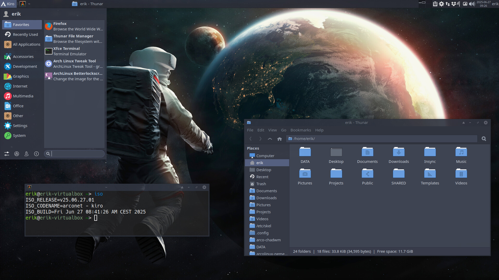
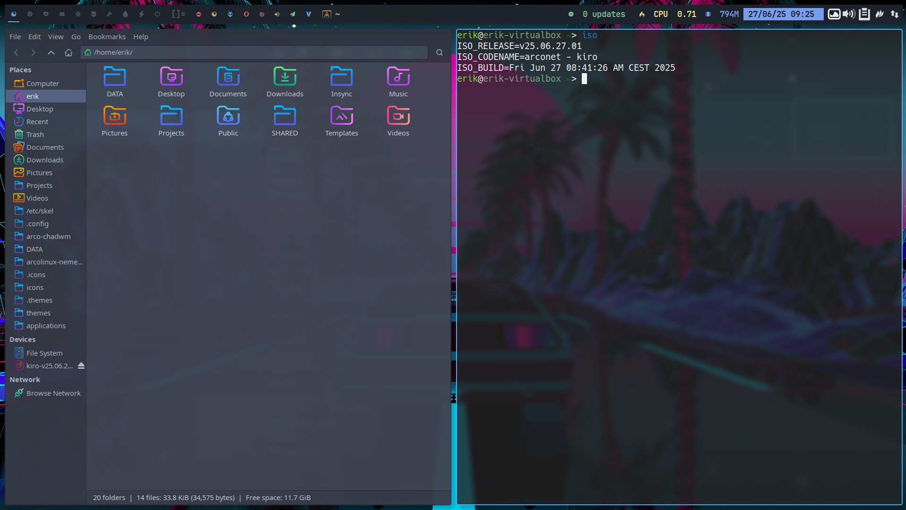

# Kiro iso






# Download

You can download the latest Kiro ISO from [our SourceForge page](https://sourceforge.net/projects/kiro/files/).

**Kiro** is a customizable Arch Linux ISO builder based on the ArcoLinux project. It provides a simple way to build your own Arch-based installation medium with your choice of packages, settings, and scripts.

Kiro is my personal choice:

- uefi
- systemd-boot
- ext4
- sddm
- xfce4 and chadwm
- a lot of free software

## 🚀 Features

- Fully customizable build process
- Based on official Arch Linux tools and methodology
- GUI from https://github.com/calamares/calamares
- Script-driven: reproducible and automatable
- Modular structure for easy extension
- Lightweight and minimal by default

## Kiro repo

```
[kiro_repo]
SigLevel = Never
Server = https://kirodubes.github.io/$repo/$arch
```

## 📦 Requirements

- Arch Linux or Arch-based system (for building) - access to necessary repos (keys - mirrors)
- `archiso` package
- Basic familiarity with Bash scripting and package management
- Knowledge how to build ISOs - https://www.arcolinuxiso.com/a-comprehensive-guide-to-iso-building/
- Playlist of all the KIRO videos - including the creation of BUILDRA based on KIRO

https://www.youtube.com/watch?v=3jdKH6bLgUE&list=PLlloYVGq5pS71UubmlKjjw131PjixMIjW

# It is super easy to create your own ISO this way

Follow this tuturial and you are already half way there.

https://youtu.be/3jdKH6bLgUE 

Live long and prosper

# Major changes after the videos on youtube

- Calamares moved from https://github.com/calamares/calamares to https://codeberg.org/Calamares/calamares - new pkgbuild
- kiro-system-installation package is no longer necessary and removed
- kiro-calamares-config has now several new modules replacing bash scripts

When studying the Buildra tutorial consider all the changes after the video and more will surely follow. 

Compare, compare and compare.

https://youtu.be/3jdKH6bLgUE

https://youtu.be/mH52To8DvlI