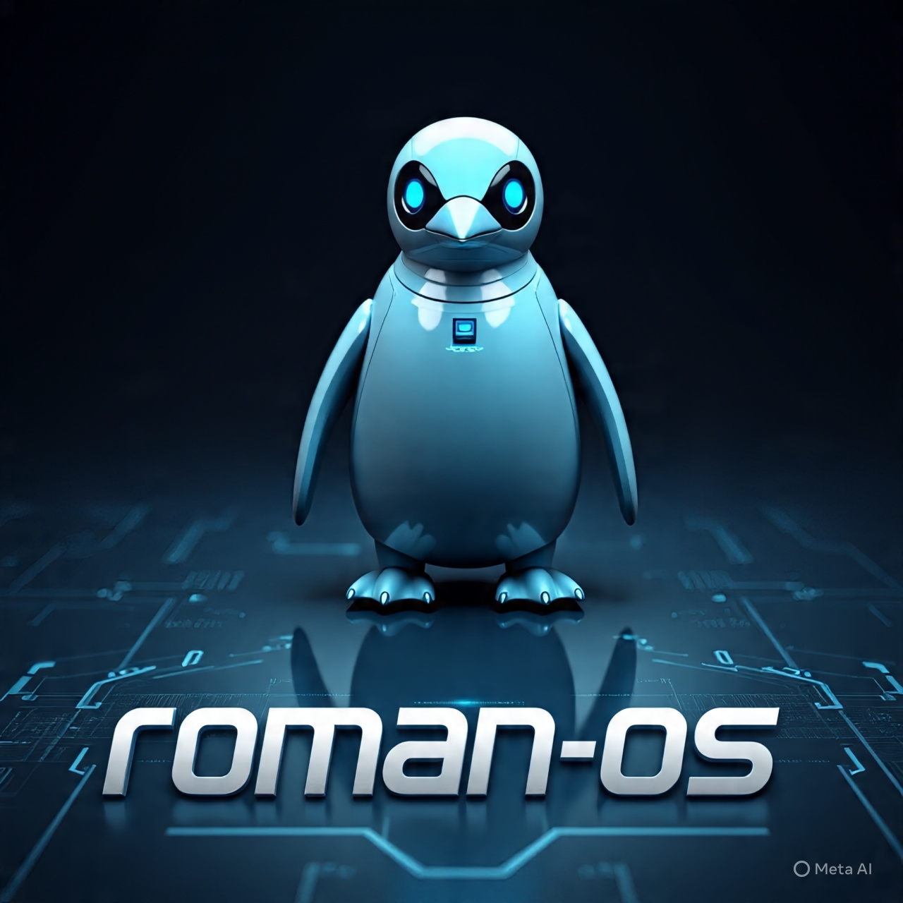
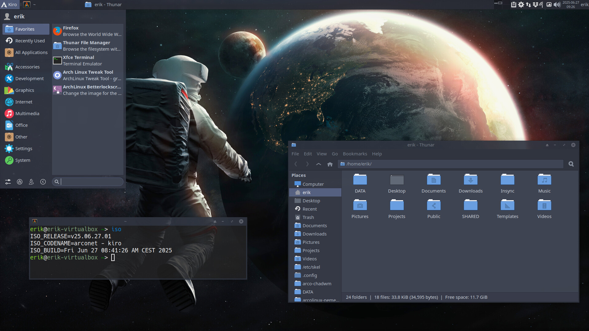
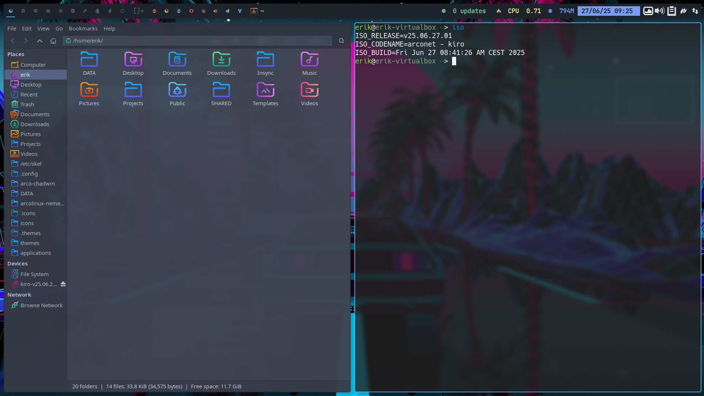

# roman-OS iso

!

roman-OS mi escritorio personal:

- uefi
- systemd-boot
- ext4
- sddm
- xfce4 and chadwm

Agradecimientos al excelente trabajo de Erik Dubois
Gracias por tanto!

Canal de youtube de Erik:

https://www.youtube.com/@ErikDubois

